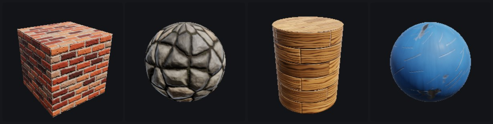
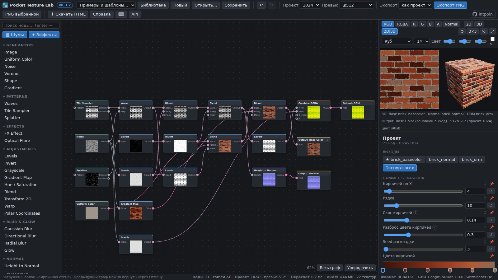
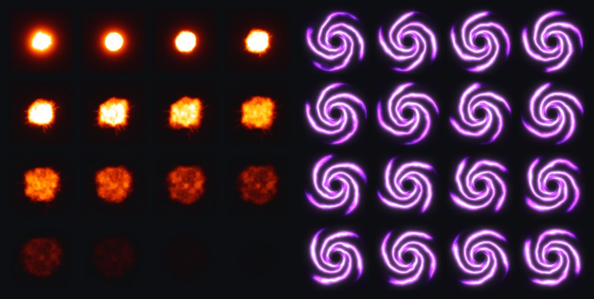

# Pocket Texture Lab

**Офлайн-редактор процедурных текстур и VFX-спрайтов для игровых движков — один HTML-файл, WebGL2, без установки.**
Нодовый граф → PBR-материал (Base Color / Normal / ORM) на 3D-объекте → PNG без потерь и спрайт-шиты.

### [▶ Открыть редактор в браузере](https://intpoln.github.io/PocketTextureLab/) · [⬇ Скачать texture-lab.html](https://github.com/intpoln/PocketTextureLab/raw/main/texture-lab.html) · [Что нового](CHANGELOG.md)







**Попробовать за минуту:** откройте редактор → «Быстрый старт» справа: выберите шаблон (например, «Кирпичная стена») →
подвигайте любой параметр шаблона → «2D | 3D» → «Экспорт всех PNG» (Base Color, Normal, ORM).

Автор: [intpoln](https://github.com/intpoln).

## ⬇ Скачайте один HTML-файл — и работайте офлайн

**Вся программа — это один файл [`texture-lab.html`](texture-lab.html).** Никакой установки, сервера, интернета,
регистрации и сборки: скачайте файл и откройте двойным щелчком в браузере. В редакторе есть кнопка **⬇ Скачать HTML**
(Ctrl+Shift+S), на GitHub — [прямая ссылка на файл](https://github.com/intpoln/PocketTextureLab/raw/main/texture-lab.html).

## Запуск

1. Откройте `texture-lab.html` в Chrome / Edge / Thorium (современный Chromium) — нужен WebGL2.
2. Сразу откроется пример «Шум → Levels → Color Ramp». Другие примеры — в меню «Примеры…».
3. Кнопка «Справка» — краткое руководство; «API» — описание программного интерфейса.

## Возможности

- Нодовый редактор: каталог с поиском, граф с HTML-нодами и SVG-проводами, панель параметров,
  изменяемый по размеру предпросмотр. Добавление, перемещение, соединение, разветвление, удаление,
  дублирование, разрыв связи, pan/zoom, запрет циклов с сообщением, undo/redo
  (одно перетаскивание ползунка = один шаг), точный ввод чисел, сброс параметра.
- Ноды (29):
  - источники — Image, Constant, **Noise** (Perlin / Flow / Value / Worley / белый / Splat Fractal из элементов; фракталы
    fBM / Ridged / Billow; растяжение, лакунарность, 1–3 уровня доменного искажения, LOD без ряби, morph / flow / сдвиг), **Voronoi** (F1, F2, трещины F2−F1, границы, значение ячейки;
    евклидова / манхэттен / Чебышёв), Shape, Gradient;
  - узоры — **Waves** (полосы с искажением: дерево, мрамор), **Tile Sampler / Раскладка** (сетка со сдвигом рядов,
    фаской, случайными позицией/поворотом/размером/яркостью; пресеты «Кирпичи», «Плитка», «Паркет», «Соты», «Булыжник»),
    **Splatter / Разброс** (до 4000 копий фигуры или входа, бесшовно);
  - обработка — Levels, Invert, Grayscale, Color Ramp (+26 пресетов градиентов: Magma, Inferno, Viridis, Огонь, Вода,
    Земля, Ржавчина, Дерево…), HSV, Blend, Transform, **Warp** (искажение по карте);
  - размытия, Height to Normal (Unity/Unreal), Split / Combine RGBA (ORM, HDRP), **Код (GLSL)**, Output.
- **Выходы материала и 3D-превью**: «Выход: Base Color / Normal / ORM» собираются в PBR-материал
  (GGX, metallic/roughness) на кубе, сфере, цилиндре или плоскости; вращение мышью, свет Shift+мышь и ползунками,
  режимы 2D / 3D / 2D|3D.
- **Анимация и спрайт-шиты**: ⏱ у любого числового параметра (начало → конец, кривые), «Эволюция» шума и Вороного
  для бесшовных петель, таймлайн с воспроизведением; экспорт листа 2×2…8×8 кадров по 64–512 px — размер всегда
  степень двойки.
- **Эффекты для частиц (нода «Эффект (FX)»)**: 19 анимированных зацикленных эффектов — пламя, огонь, взрыв, дым (клуб и
  столб), искры (разлёт и фонтан), молния, электрические дуги, вспышка/солнце, блик-звезда, ударная волна, магический
  круг, энергосфера, портал, лазер, слэш, облако, каустика; палитры с альфой, прозрачный или чёрный фон, выход
  интенсивности для своих градиентов. Готовые флипбуки: пламя свечи, взрыв с искрами, магический круг, молния,
  портал, энергосфера. Нода «Свечение (Glow)» добавляет ореол (bloom), «Полярные координаты» сворачивают полосы в кольца.
- **Оптическая вспышка (Optical Flare)** — спрайт-вспышка для игровых VFX (взрыв, граната, выстрел, сварка): сияние
  и ядро, лучи-звезда, мерцающие лучи, анаморфные полосы, кольцо с радужной каймой. Всегда по центру кадра, HDR-свет,
  чёрный фон для аддитивного смешивания или прозрачный; 5 пресетов: Sun, Anamorphic, Spotlight, Welding, Soft orb.
- **Окно «Шумы / Эффекты» с превью** (кнопки над каталогом): 30 готовых настроенных шумов — облака, горы/гребни,
  прожилки, клубы, турбулентность, мрамор, текучий (domain warp), туман, гранж, пятна, Ворли, клеточный fBM, белый шум,
  зерно, пиксельный, шлифованный металл, волокна дерева, штрихи/дождь, дюны, варианты Вороного, полосы — и все 19
  эффектов FX. Щелчок по карточке добавляет ноду, карточку можно перетащить на граф. Разделы каталога сворачиваются.
- **Английские названия нод и параметров**, как в Substance Designer, Houdini, After Effects, Photoshop (Levels,
  Blend / Multiply, Hue / Saturation, Gaussian Blur, Tile Sampler…); русское название — во всплывающей подсказке,
  поиск понимает оба языка.
- **Быстрое добавление**: провод, отпущенный в пустом месте (или Tab), открывает меню нод с поиском — нода появляется
  там же и сразу подключена.
- **Закреплённое превью**: двойной щелчок по ноде закрепляет её в превью, одиночный щелчок — выбор ноды для настройки.
- **Статистика внизу окна**: ноды и связи, разрешение проекта и превью, время пересчёта, занятая видеопамять,
  формат вычислений, FPS при воспроизведении, видеокарта.
- **Цветные пины**: серый — вход/выход «оттенки серого», розовый — цвет, половинка — принимает и то и другое.
  Провода окрашены по типу источника.
- **Шаблоны материалов** (меню «Примеры и шаблоны…»): кирпичная стена, асфальт с трещинами, булыжная мостовая,
  деревянные доски, окрашенный металл со сколами (+ пример «металлические панели» про упаковку ORM) — у каждого
  3 выхода (Base Color, Normal, ORM) и вынесенные
  параметры: снимите выделение с нод — справа появятся ползунки шаблона. Любой параметр можно вынести кнопкой 📌.
  «Экспорт всех» сохраняет все Output разом.
- **Библиотека**: свои пресеты любой ноды и свои шаблоны проектов сохраняются в браузере (localStorage);
  экспорт/импорт библиотеки файлом для резервной копии и переноса на другой компьютер.
- Предпросмотр: RGB, RGBA на шахматке, отдельные каналы R/G/B/A, освещённая normal map,
  повтор 3×3, сдвиг на ½, значения пикселя под курсором, уменьшенное разрешение во время
  перетаскивания ползунка.
- Точность: RGBA16F (с проверкой поддержки; иначе RGBA8 с предупреждением), неpremultiplied
  каналы, маски без гамма-коррекции, собственный lossless-кодер PNG (RGB сохраняется при A=0),
  прямой декодер PNG (UPNG.js), ориентация строк без переворотов.
- Проект JSON (версия формата, ноды, связи, параметры, позиции, разрешение, основной выход,
  встроенные изображения). Сохранение скачиванием, открытие выбором файла или перетаскиванием.
- **Телефон и планшет**: на узком экране — отдельная раскладка с нижней навигацией (Граф / Ноды / Превью / Параметры),
  жестами (сдвиг пальцем, масштаб двумя пальцами) и свёрнутой панелью инструментов (☰).
- Программный интерфейс `window.PTL` для скриптов и AI-агентов (см. ниже).

## Для AI-агентов и автоматизации

На странице есть глобальный объект `window.PTL`, через который доступно всё, что умеет UI:
`PTL.nodeTypes()`, `addNode`, `connect`, `setParams`, `render`, `renderPNG`, `saveProject`,
`importImage`, `errors`, `undo` и т.д. Руководство (API, описание всех нод, методика и рецепты материалов) встроено в сам HTML
(`PTL.help()`, `<script type="text/markdown" id="ptl-agent-guide">`, комментарий в начале файла) — агенту,
открывшему страницу, больше ничего не нужно,
а также лежит в [`docs/AGENT_GUIDE.md`](docs/AGENT_GUIDE.md).

Новую функциональность можно добавлять нодой «Код (GLSL)»: пишете функцию
`vec4 process(vec2 uv, ivec2 px)`, читаете входы `in0(px)…in3(px)`, используете ползунки `p1…p4`.

## Публикация в интернете (бесплатно)

Это один статический файл, подойдёт любой статический хостинг:

- **GitHub Pages** — в репозитории есть workflow `.github/workflows/pages.yml`. Один раз включите
  *Settings → Pages → Source: GitHub Actions*; после каждого пуша в ветку по умолчанию сайт обновляется по адресу
  `https://<user>.github.io/<repo>/` (для этого репозитория — https://intpoln.github.io/PocketTextureLab/).
  Статус и ссылка — во вкладке *Actions* и в *Settings → Pages*. (Для приватного репозитория Pages требует платный план —
  тогда сделайте репозиторий публичным или используйте варианты ниже.)
- **Cloudflare Pages / Netlify** — перетащите папку с файлом, переименованным в `index.html`,
  в веб-интерфейс (Netlify Drop, Cloudflare «Direct Upload»), без аккаунта на GitHub.
- **Vercel, Surge.sh, Neocities, itch.io (HTML-проект)** — тоже бесплатно принимают один HTML.

## Версии

Текущая версия видна в панели инструментов рядом с названием (щелчок — список изменений) и в `PTL.version`.
История изменений — [`CHANGELOG.md`](CHANGELOG.md). Номер версии хранится в `package.json` и повышается с каждым
обновлением; при сборке он вшивается в `texture-lab.html`.

## Разработка

Исходники модульные (`src/`), итоговый файл собирается скриптом:

```sh
npm install        # только для разработки: playwright, pngjs, pako, upng-js
npm run build      # src/ -> texture-lab.html
npm test           # сборка + 238 проверок в настоящем Chromium через file://
node tests/perf.mjs
node tools/ptl-run.mjs script.js out/   # выполнить сценарий PTL без UI и сохранить PNG
node tools/readme-shots.mjs             # пересобрать картинки README (docs/img) из настоящего редактора
```

Структура: `png.js` (PNG), `gpu.js` (WebGL2, пул текстур, проходы), `shaders.js` (GLSL),
`nodes.js` (определения нод), `graph.js` (модель, undo), `engine.js` (кэш и пересчёт только
изменившихся нод), `ui-*.js`, `app.js`, `api.js`.

## Соглашения

- UV: u вправо, v вниз; строка 0 — верх изображения (как в PNG). Переворотов нет ни при
  загрузке, ни при чтении с GPU; экран переворачивается только при отображении.
- Цвет: цветные данные внутри хранятся в линейном свете (размытие/смешивание физически корректны),
  в файл и на экран кодируются в sRGB. Данные (маски, высота, нормали, упаковка) не преобразуются.
- Normal map: касательное пространство, X вправо, Y вверх (OpenGL); DirectX = инверсия зелёного.
  Постоянная высота → (128,128,255). Strength = высота перепада 0→1 в % от ширины текстуры.
- Blend: `mix(A, op(A,B), сила·маска)` покомпонентно, без скрытого alpha compositing; альфа по той же
  формуле или из A.
- Радиусы фильтров задаются в пикселях проекта и масштабируются для уменьшенного предпросмотра.

## Лицензии встроенных библиотек

UPNG.js 2.1.0 (MIT, © Photopea; исправлена ошибка 1-битного Adam7) и pako 1.0.11 (MIT + zlib).
Тексты лицензий — в начале встроенного скрипта в `texture-lab.html` и в `src/vendor/`.
