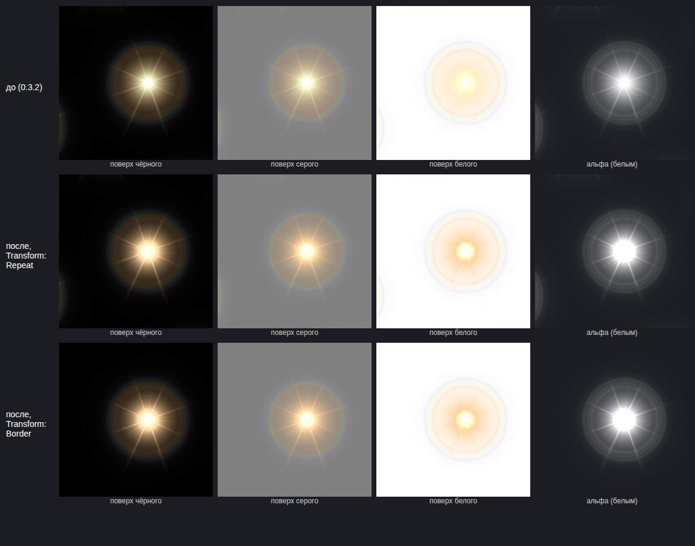

# Качество вычислительного ядра: контракты, аудит, статус

Рабочий документ по заданию «качество нод, аудит и рефакторинг» (аудит публичного commit `9e48f70`, 27.09.2026).
Здесь — определённые контракты, что проверено на GPU, что исправлено, чем это доказано и что ещё не сделано.
Все измерения — Chromium + SwiftShader (программный WebGL2, `--use-angle=swiftshader`), если не сказано иное;
на аппаратных GPU результаты отдельно не проверялись.

Инструменты воспроизведения (запускаются из корня репозитория после `npm run build`):

| Скрипт | Что делает |
|---|---|
| `node tools/audit-a.mjs [file.html]` | зонды этапа A на контрольных изображениях (кодовая нода даёт точные входы) |
| `node tools/compare-builds.mjs old.html new.html` | рендер всех встроенных примеров двумя сборками, попиксельная разница + разница света в линейном пространстве поверх чёрного |
| `node tools/chain-a1.mjs old.html new.html out.jpg` | цепочка Flare → Glow → Transform → Output двумя сборками поверх чёрного/серого/белого + альфа |
| `npm test` | все проверки, включая блок «Этап A» |

## Контракты

**Цвет и данные.** Вход/выход каждой ноды помечен как `color` (внутри — линейный свет, в файле и на экране — sRGB)
или `data` (числа каналов, пишутся в файл как есть). Преобразование — только на границах: при чтении входа
(`u_convN`) и записи результата (`u_outConv`). Альфа никогда не гамма-кодируется.

**Straight / premultiplied.** Между нодами изображения хранятся straight (неpremultiplied) — это сохраняет
числовые RGBA-каналы и RGB при A=0 (упаковка карт, точный PNG). Внутри image-фильтров допускается premultiplied:
- *alpha-aware* выборка (`in0B(uv, true)`) умножает каждый из четырёх texel-ов на его альфу **до** билинейной
  интерполяции и делит на альфу в конце. Невидимый пиксель со скрытым цветом не даёт каймы.
- без alpha-aware каналы интерполируются независимо — режим данных, скрытый RGB сохраняется.
- Смысл альфы задаётся **явной галочкой ноды** («С учётом альфы»), а не пространством color/data.

**Граница (что фильтр видит за краем).** Единый механизм для всех image-фильтров:
`Repeat` — противоположный край (бесшовные текстуры), `Clamp` — продолжение крайних пикселей,
`Border` — прозрачный ноль (спрайты, эффекты на пустом холсте). В WebGL2 нет `CLAMP_TO_BORDER`, поэтому
Border реализован в шейдере: `inNT(p)` (точный texel с границей) и `inNB(uv, premul)` (ручная билинейная
выборка из четырёх `inNT`) — каждый tap проверяется отдельно, а не только центральный UV.
Для нод с двумя входами поведение задано явно: **Warp** читает источник в выбранном режиме, а карту — Repeat
при Repeat и Clamp при Clamp/Border (пустота за краем карты не должна давать ложный градиент).
Normal (Height to Normal) и Image оставлены с Repeat/Clamp: для высоты «ноль за краем» дал бы ложный обрыв.

**Glow.** Свечение — это добавочная световая энергия. Bright pass: `k = smoothstep(thr−knee, thr+knee, max(RGB))`
(при knee = 0 — явный жёсткий порог `step`), энергия `e = RGB·A·k` (premultiplied), её альфа = `max(e)`.
Чёрное или невидимое не светится и не создаёт непрозрачности. Сборка «вход + свечение»: premultiplied сумма,
альфа = max(покрытие `A + a_g(1−A)`, самый яркий premultiplied канал) — так straight RGB ≤ 1 и 8-битный экспорт
сохраняет свет поверх чёрного без клиппинга.
*Ограничение:* одна альфа не может одновременно быть «покрытием» и «энергией». Файл рассчитан на смешивание в
линейном пространстве (Linear-режим движков) и на Additive (берите RGB, в FX/Flare — чёрный фон).
При смешивании в sRGB-пространстве полупрозрачный ореол будет чуть темнее.

**HDR.** Внутри RGBA16F значения > 1 сохраняются (Glow, Flare, Blend Add не обрезают энергию). Предпросмотр и
8-битный PNG используют одно и то же отображение: кодирование в sRGB и обрезка [0, 1]. На RGBA8-fallback
(нет float-рендера) энергия > 1 теряется на каждом шаге — об этом предупреждает статус «Формат».

**Совместимость.** Проекты хранят `engine` (версия вычислений). Проекты без него (до 0.4) открываются с
прежними значениями параметров, у которых сменился default (`LEGACY_DEFAULTS` в `nodes.js`):
Transform/Warp/Polar — «С учётом альфы» выкл., Glow — край Clamp. Если в проекте есть Glow, Warp или
alpha-aware размытия, показывается предупреждение: исправленные ноды могут дать немного другой результат.

## Этап A — операции над изображением (сделано в 0.4.0)

Исходное состояние: commit `60a6304` (0.3.2), 212 проверок проходят. Зонды `tools/audit-a.mjs`:

| Находка аудита | На GPU до | Причина | Исправление | После |
|---|---|---|---|---|
| Glow создаёт альфу из чёрного | подтверждено: чёрный непрозрачный вход, порог 0, knee 0.15 → «только свечение» A = 191/255 | альфа bright pass = `A·k`, не зависит от энергии | альфа = max(энергии) | A = 0 везде |
| knee = 0 → NaN | не воспроизвелось на SwiftShader (A = 0), но `smoothstep(e,e,x)` не определён по спецификации | — | явный `step` | A = 0, NaN нет |
| Warp игнорирует границу карты | подтверждено: рампа, gradient, Clamp → последняя колонка 237 вместо ~254 | `mapAt` всегда `wrapPx(p, true)` | карта читается `in1T` в объявленном режиме | 253 (продолжение рампы) |
| alpha-aware Directional/Radial: интерполяция до premultiply | подтверждено: скрытый синий в видимых пикселях 150/255 (Directional), 174/255 (Radial); Gaussian — 0 | аппаратная билинейная выборка straight RGBA | `in0B(uv, true)`: premultiply каждого texel-а до интерполяции | 0 |
| Нет режима Border | подтверждено | только Repeat/Clamp | Border во всех image-фильтрах | импульс у края совпадает с эталонной свёрткой (ошибка ≤ 0.5/255) |
| Квадратная маска edgeFade во Flare | подтверждено: широкое круглое свечение на радиусе 0.9 — альфа 8 на оси и 17 на диагонали | `max(|x|,|y|)` | круглое затухание к вписанной окружности | 7 и 7 |
| Polar: рваный центр | найдено при аудите C: у центра билинейная выборка брала противоположный край полосы (Repeat по v) | — | v зажат к центрам первой/последней строки | — (визуальная проверка — этап C) |
| Radial Blur: деление на 0 при 1 выборке | деление `k/(n−1)` | — | `max(n−1, 1)` | — |

Цепочка A1 (Flare → Glow → Transform, поворот 20°, масштаб 0.85, сдвиг) — `docs/img/quality/a1-flare-chain.jpg`:

Что видно: (1) копия ореола у левого края в строках «до» и «после, Repeat» — это **Repeat у Transform**
(содержимое, сдвинутое за край, возвращается с другой стороны), корректное поведение для тайлов и вероятная
причина ореола у границы спрайта; с Border его нет. (2) Поверх белого и серого новая версия не кладёт
тёмную вуаль вокруг ореола (альфа больше не завышена относительно света). (3) В альфа-канале нет рамки.

Совместимость (`tools/compare-builds.mjs`, все встроенные примеры, 256 px, кадр 0.25): все материалы и
3 из 6 флипбуков **побайтно совпадают**. Отличаются Магический круг, Молния, Портал — это Glow: свет поверх
чёрного в линейном пространстве отличается не более чем на 2/255 в «только свечение»; в «вход + свечение»
до 15–17/255 там, где старая версия обрезала свет (B = 255 при A = 240) — новая сохраняет его.

Проверки (`npm test`, блок «Этап A»): чёрное → Glow-only = 0 при пороге 0 и knee 0/0.15; скрытый RGB не
проникает в Directional/Radial/Gaussian/Transform/Warp с альфой; режим данных сохраняет скрытый RGB;
импульс у края против эталонной свёртки для Repeat/Clamp/Border; Warp — нейтральная карта и сила 0 сохраняют
вход, карта 1 сдвигает ровно на «силу»; Flare — без квадратной рамки; миграция старых проектов.

Не сделано на этапе A: пункт A6 полностью (сравнение downsample/upsample пирамиды Glow с прямой свёрткой по
позиции относительно сетки пикселей) — пирамида не менялась; фильтрация Transform при сильном уменьшении
(нет mip) — перенесено в этап C.

## Этап B — Noise v2

Не начат. План: затухание неразрешимых октав по размеру пикселя (с учётом stretch и warp), семейства
Gradient/Flow, Cellular, Structured Splat Fractal; группы параметров; morph/flow в анимации; legacy-путь.

## Этап C — матрица нод

Не заполнена. Будет: нода → художественная задача → текущий алгоритм → недостатки → изменение →
контрольный граф → статус.

## Этап D — демонстрационные графы

Не начат.
